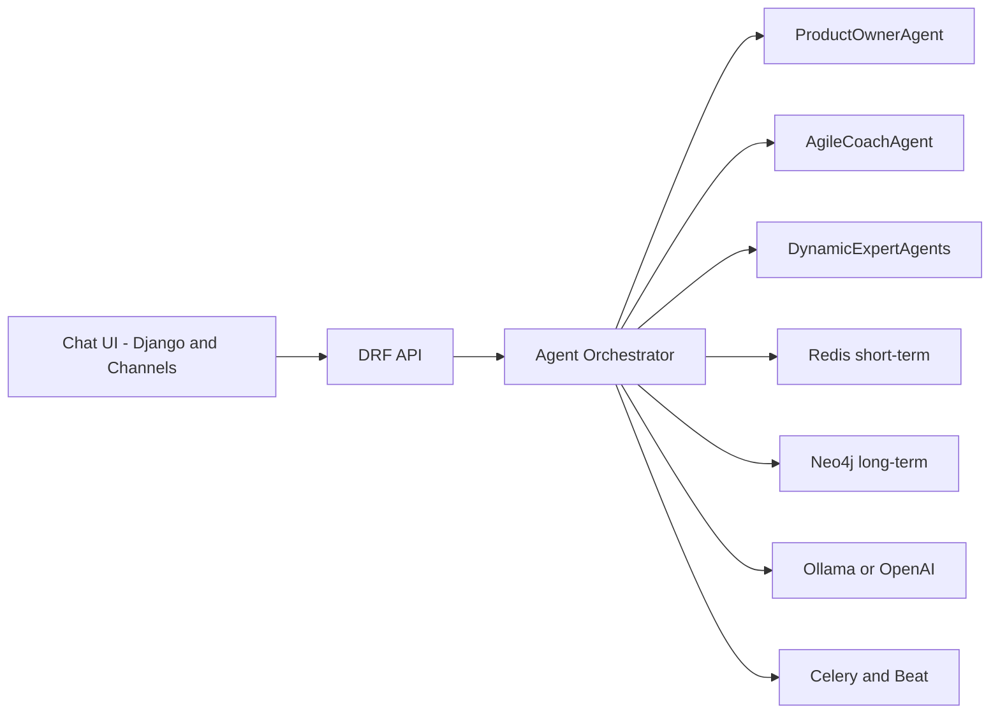

# AITEAM — Agile Agentic AI System
[](https://github.com/personalagile/aiteam/actions/workflows/ci.yml)

A Django-based, API-first, multi-agent system following agile values. It boots with two agents:
- Product Owner (PO)
- Agile Coach (AC)

They collaborate to spawn cross-functional expert agents, maintain short- and long-term memory, and iterate with regular retrospectives.

## Quick Start

Using Makefile (recommended)
```
make install
cp env.example .env
# optional local services
docker compose up -d redis neo4j ollama
.venv/bin/python manage.py migrate
make daphne   # or: make run
```
Open http://127.0.0.1:8001 for the chat UI (Daphne) or http://127.0.0.1:8000 (runserver).

Alternative: Manual setup

1) Create a virtual environment and install dependencies
```
python -m venv .venv
. .venv/bin/activate
.venv/bin/pip install -e ".[dev,agents,docs]"
```

2) Configure environment
```
cp env.example .env
```
Set variables for Redis, Neo4j, Ollama/OpenAI as needed.

3) Optional: start local services via Docker
```
docker compose up -d redis neo4j ollama
```

4) Run the app

Option A (recommended for Channels/WS): Daphne
```
.venv/bin/python manage.py migrate
.venv/bin/daphne -b 127.0.0.1 -p 8001 aiteam.asgi:application
```
Open http://127.0.0.1:8001 for the chat UI.

Option B: Django dev server
```
.venv/bin/python manage.py migrate
.venv/bin/python manage.py runserver 127.0.0.1:8000
```
Open http://127.0.0.1:8000 for the chat UI.

## Architecture (Mermaid)


## Documentation
See `docs/arc42/arc42.md` for the full Arc42 architecture documentation (with Mermaid diagrams).

API documentation (OpenAPI) is available when the server is running:
- JSON schema: `GET /api/schema/`
- YAML schema: `GET /api/schema.yaml`
- Swagger UI: `GET /api/docs/`
- Redoc UI: `GET /api/redoc/`

## Features
- Product Owner (PO) and Agile Coach (AC) core agents
- Progressive planning streamed over WebSocket
  - Events: `po_plan_start`, `po_plan_step`, `po_plan_final`
- Agile Coach feedback after planning: `ac_feedback`
- Dynamic expert updates over WebSocket: `expert_update`
- Cross-domain expert selection (IT and non-IT) via heuristic + optional LLM
  - Unknown LLM-returned roles are preserved as-is, enabling non-IT experts
- Orchestrator-driven experts pipeline (Celery) exposed via API
- Short-term memory (Redis; shared in-memory fallback for dev/tests)
- Long-term memory (Neo4j) minimal note upserts
- REST API: health, version, memory, planning, feedback, agent thinking,
  experts pipeline, retrospective
- Tests (pytest) and CI (GitHub Actions)

## WebSocket Protocol
Path: `/ws/chat/`

Client → Server
```
{ "message": "Build chat" }
```

Server → Client events
```
{ "type": "system", "message": "Connected to AITEAM chat." }
{ "type": "po_plan_start", "message": "Planning started." }
{ "type": "po_plan_step", "index": 1, "task": "Define acceptance criteria for: Build chat" }
{ "type": "po_plan_final", "message": "Plan ready: 2 task(s)", "tasks": ["...", "..."] }
{ "type": "ac_feedback", "message": "Define measurable acceptance criteria. ..." }
{ "type": "expert_update", "message": "Selecting experts...", "experts": [] }
{ "type": "expert_update", "expert": "frontend", "message": "Prepared for: Build chat" }
{ "type": "expert_update", "message": "Experts prepared.", "experts": ["frontend", "backend"] }
```

Note: The initial `expert_update` may include an optional `_debug` object with
fields such as `provider`, `prompt`, `raw`, and `parsed` to aid debugging of
LLM/heuristic-based expert selection.

## REST API
- `GET /api/health` → `{ "status": "ok" }`
- `GET /api/version` → `{ "version": "x.y.z" }`
- `GET /api/memory/<agent>/history?limit=20` → `{ agent, limit, items }`
- `POST /api/memory/<agent>/append` with `{ item }`
- `POST /api/plan` with `{ description }` → `{ tasks, count }` (add `_debug` with `?debug=1`)
- `POST /api/ac_feedback` with `{ tasks: [...] }` → `{ feedback }`
- `POST /api/agent/think` with `{ agent: "po"|"ac", goal }` → `{ thought }` (add `_debug` with `?debug=1`)
- `POST /api/experts/run[?debug=1][&async=1]` with `{ description }`
  - Response: `{ tasks, experts, results: { [expert]: message }, _debug? }`
  - `_debug` may include LLM traces (e.g., provider, prompt, raw) when available
  - Async scheduling is attempted only when `REDIS_URL` is configured; otherwise executes in-process
  - Cross-domain expert selection supported (legal, finance, marketing, HR, etc.). Unknown roles from LLM are preserved.
- `POST /api/retro/run` → `{ accepted: true, scheduled: bool }`

## Configuration
Key environment variables (see `env.example`):
- `REDIS_URL` — Redis for short-term memory
- `NEO4J_URI`, `NEO4J_USER`, `NEO4J_PASSWORD` — Neo4j for long-term memory (optional)
- `OLLAMA_HOST` or `OPENAI_API_KEY` — LLM integration (optional)
- `DJANGO_SECRET_KEY`, `DJANGO_DEBUG`, `ALLOWED_HOSTS` — Django
- `EXPERTS_USE_ORCHESTRATOR` — When `1` (or `true`/`yes`/`on`), WebSocket expert preparation is delegated to the orchestrator; otherwise runs in-process

## Development
- Preferred runner: `make daphne` (ASGI on port 8001)
- Alternative: `.venv/bin/daphne -b 127.0.0.1 -p 8001 aiteam.asgi:application`
- Web UI: `templates/chat/index.html`
- WebSocket consumer: `apps/chat/consumers.py`
- Agents: `agents_core/*`

## Testing
Using Makefile
```
make test
```
Manual
```
.venv/bin/pytest -q
```

## Linting & Formatting
Using Makefile
```
make fmt   # isort, black, ruff --fix
make lint  # ruff, black --check, isort --check-only, pylint
```
Manual
```
.venv/bin/ruff check .
.venv/bin/black --check .
.venv/bin/isort --check-only .
.venv/bin/pylint aiteam apps agents_core memory orchestrator tools
```

## Contributing
Contributions are welcome!
- Use Python 3.10+, type hints, and PEP 8.
- Format with Black; sort imports with isort; lint with Ruff and Pylint (≥ 9.0).
- Add tests (pytest) for new features and bug fixes.
- Describe architecture changes in `docs/arc42/arc42.md`.
- Open a PR with a clear description, steps to test, and checklist.

See `CONTRIBUTING.md` for detailed contribution guidelines.

## Code of Conduct
Please read `CODE_OF_CONDUCT.md`.

## Security
Please read `SECURITY.md`.

## Changelog
See `CHANGELOG.md`.

## License
MIT License. See `LICENSE`.

## CI
See `.github/workflows/ci.yml`.
