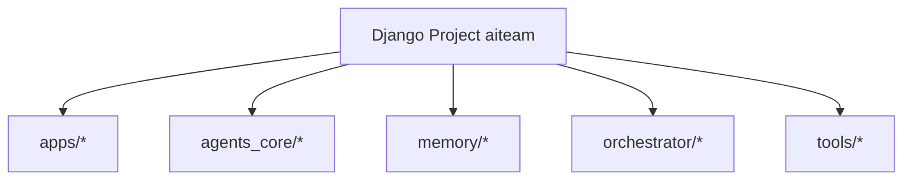
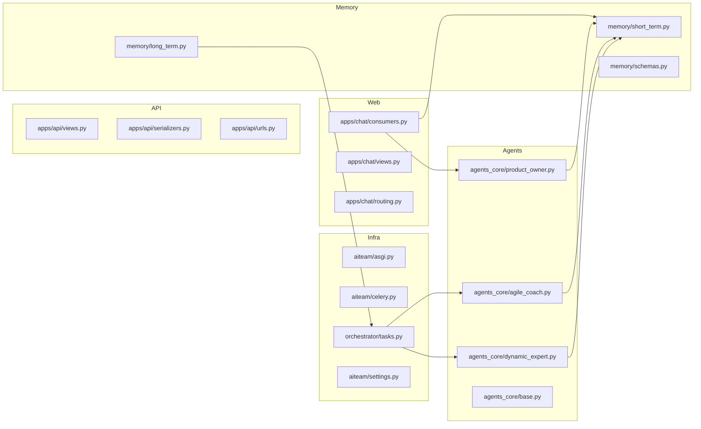
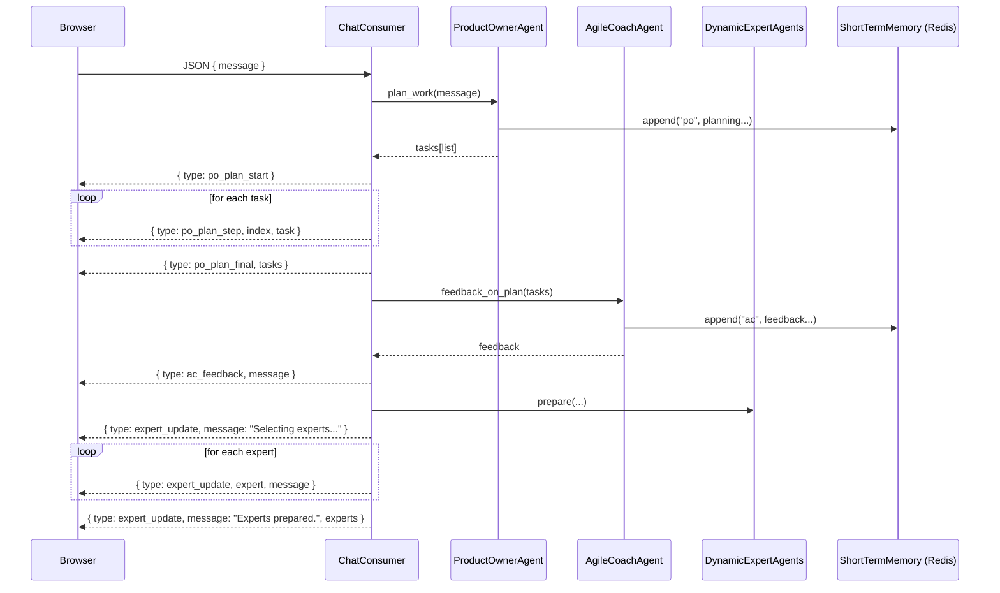
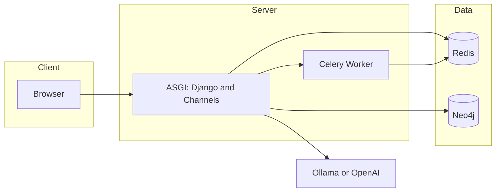

# arc42 – Architecture Documentation AITEAM

Version: 0.1.0 • Date: 2025-08-24

## 1. Introduction and Goals

AITEAM is an agile, agentic AI system. It boots with two core agents:
- Product Owner (PO)
- Agile Coach (AC)

Users interact with the PO through a chat UI. PO and AC select cross-functional experts when needed and spawn dynamic expert agents. Each agent has short-term (Redis) and long-term memory (Neo4j) and may access the internet. Goal: an iterative, learning system that plans, executes, and continuously improves work.

Non-goals: a full MLOps/vector database platform, proprietary tool integrations beyond a minimal demo.

## 2. Constraints
- Language: Python ≥ 3.10, Django 5+, Channels, Celery
- Data: Redis (STM), Neo4j (LTM)
- LLM: local Ollama, optional OpenAI
- Quality: Pylint ≥ 9.0, Ruff, Black, isort, pytest
- Deployment: Docker Compose for dev, optional containerized

## 3. System Context
```mermaid
flowchart LR
  User[User] --> UI[Chat UI (Django and Channels)]
  UI -->|WebSocket| WS[ChatConsumer]
  UI -->|HTTP and REST| API[REST API]
  WS --> ORCH[Orchestrator]
  API --> ORCH
  ORCH --> PO[ProductOwnerAgent]
  ORCH --> AC[AgileCoachAgent]
  ORCH --> EXP[DynamicExpertAgents]
  ORCH --> STM[(Redis Short-term)]
  ORCH --> LTM[(Neo4j Long-term)]
  ORCH --> LLM[Ollama or OpenAI]
  ORCH --> Celery[Celery Worker]
  Celery --> STM
```

## 4. Solution Strategy
- API-first, event-driven via WebSocket (Channels)
- Loose coupling, clear responsibilities per agent
- Short feedback loops (PO plans, AC coaches, experts solve)
- Persist learning: short- vs. long-term
- Test-driven, quality-assured development

## 5. Building Block View
### 5.1 Level 1


### 5.2 Level 2 – Main Components


## 6. Runtime View
### 6.1 Chat message → PO planning with streaming


## 7. Deployment View


## 8. Cross-cutting Concepts
- Logging/Tracing: structlog
- Configuration: .env/environment variables (`aiteam/settings.py`)
- Storage: short-term Redis lists, long-term Neo4j graph
- Fault tolerance: optional dependencies with graceful fallback
- Security: minimal for dev; extendable with AuthN/Z, rate limits
- Tests/Quality: pytest, Ruff, Black, isort, Pylint; CI via GitHub Actions

## 9. Architectural Decisions (ADRs)
- Django + Channels for WebSocket communication
- Celery for asynchronous/long-running tasks
- Redis as STM (simple, performant)
- Neo4j as LTM (knowledge graph)
- Local Ollama, optional OpenAI

## 10. Quality Requirements
- Reliability: tests ≥ 90% targeted (unit/integration/UI)
- Maintainability: Pylint ≥ 9.0, typing, docstrings
- Extensibility: clear agent interfaces, modular tools
- Observability: structured logs

## 11. Risks & Technical Debt
- LLM dependencies (availability, cost, quality)
- Orchestration complexity as agent count grows
- Rudimentary security/rate limiting

## 11.1 Feature Status (Implemented / Stubs / Planned)

### Implemented
- Chat UI with WebSocket integration to PO and STM
  - Files: `apps/chat/consumers.py`, `templates/chat/index.html`, `agents_core/product_owner.py`, `memory/short_term.py`
- Streaming planning steps (`po_plan_start`, `po_plan_step`, `po_plan_final`)
  - Files: `apps/chat/consumers.py`, `templates/chat/index.html`
- Agile Coach feedback after planning (`ac_feedback`)
  - Files: `agents_core/agile_coach.py`, `apps/chat/consumers.py`
- REST API: health and STM history (`/api/health`, `/api/memory/<agent>/history`)
  - Files: `apps/api/views.py`, `apps/api/urls.py`
- Short-term memory: Redis with shared in-memory fallback for dev/tests
  - Files: `memory/short_term.py`
- Logging: structlog configuration
  - File: `aiteam/settings.py`
- Tests: WebSocket streaming and API
  - Files: `tests/test_chat_ws.py`, `tests/test_api_memory.py`
- CI (basic): GitHub Actions workflow
  - File: `.github/workflows/ci.yml`

### Stubs (placeholder logic available)
- Dynamic experts (selection/orchestration is stubbed; events `expert_update`)
  - Files: `agents_core/dynamic_expert.py`, `apps/chat/consumers.py`
- Long-term memory (Neo4j) minimal implementation, optional
  - File: `memory/long_term.py`
- Orchestrator/Celery flows (retrospective as stub)
  - File: `orchestrator/tasks.py`

### Planned (not implemented yet)
- LLM integration (Ollama/OpenAI) in agent planning/action
- Orchestrator workflows for real parallel expert work
- UI improvements (error states, status badges, history panel)
- Security: authentication/authorization, rate limiting

## 12. Glossary
- PO: Product Owner Agent
- AC: Agile Coach Agent
- STM: Short-Term Memory (Redis)
- LTM: Long-Term Memory (Neo4j)
